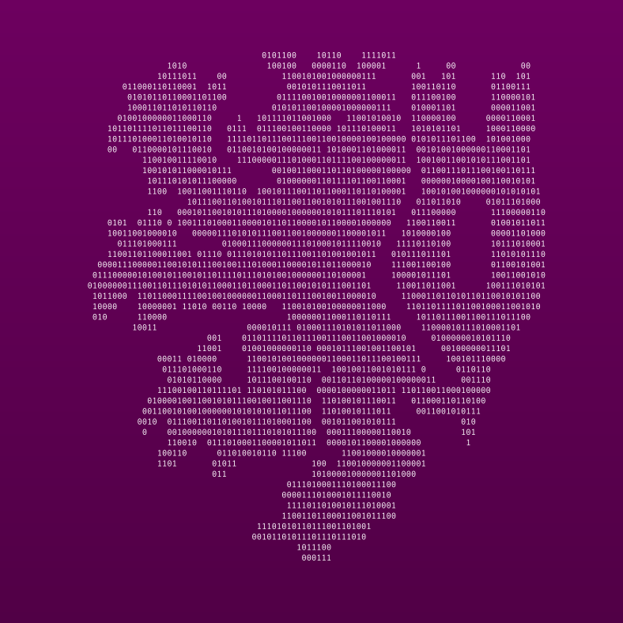

# Automated Side-Channel Analysis Tool (AutoSCA-tool)

  


This tool is able to automatically test a TLS server for Bleichenbacher-like padding side channels.

## Installation
First, ensure that the following packages (and a working C compiler) are installed:

```python3 pip3 libxml2-dev libxslt-dev tcpdump tshark default-jre maven cmake```

Then run the shell script `setup.sh` in a terminal of your choice.
It should take care of the entire setup for you.
If you want to run the TLS servers as docker containers, you also need to manually set up a docker environment.

## Usage
You can execute the following command to check a local TLS server and test if every component works:

```./start.sh --docker --name apollolv/damnvulnerableopenssl-server --tag quicktest --port 4433 --latency 10ms --clientarguments "--repetitions 20 --noskip"```

You should get successful execution until the actual machine learning starts.
This is indicated by the message `Starting classification model learning`.
Because our dataset is too small (a mere 20 handshakes in this test), the learning process is expected to fail.

This command runs the core script `./start.sh`. 
For this test, we use a vulnerable TLS server provided in a docker container on dockerhub.
The `--docker` parameter starts the desired container.
The container name needs to be provided with `--name`, which can be either pulled from dockerhub or locally built.
We also add a small, simulated network latency between client and server with `--latency`.
The results will be written to a subfolder of `datasets`, identified by the current date and experiment name (`--tag`).
All arguments provided after `--clientarguments` will be given as parameters to the client script.
In this case, we want the client to send 20 requests (`--repetitions`) and to execute a full handshake (`--noskip`).
`--noskip` consequently instructs the client to send both the ChangeCipherSpec and ClientFinished message.

### Remote example
The following example will check a remote server for Bleichenbacher side channels:

```./start.sh --tag googletest --host www.google.com --interface enp0s3 --clientarguments "--repetitions 20 --noskip --wait 1 --processes 1"```

You may need to adjust the `--interface` parameter to your local network interface name.
We are also using the `--wait` parameter to instruct the client to wait 1 second between each request.
This can prevent flooding the target server with too many requests.
